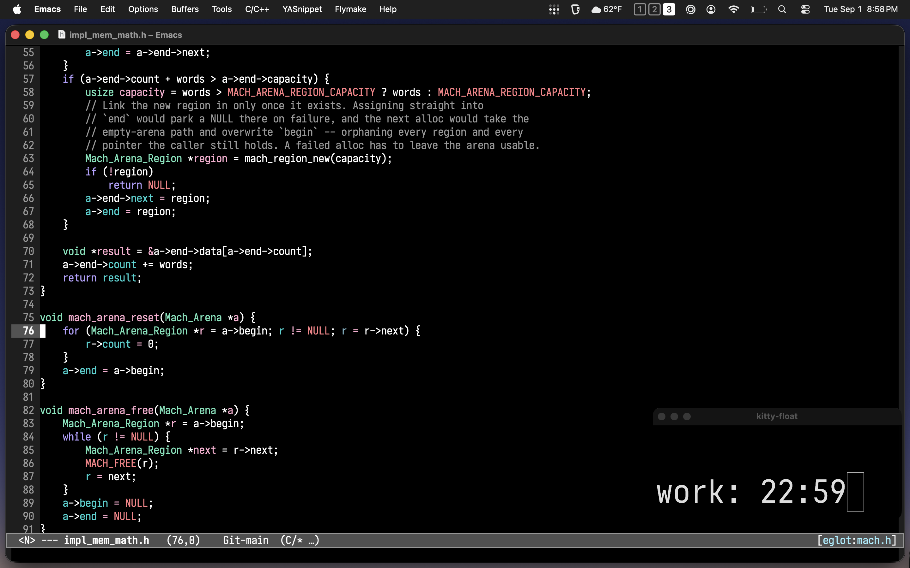

# pomo.py

A minimal command-line Pomodoro timer written in Python.

## Usage

```sh
pomo
```

Defaults to a 25-minute work session and 5-minute break.

```sh
pomo 50
pomo 50 --break 10
```

Press `Ctrl-C` at any time to quit.

I keep the timer visible in a cropped terminal window above my workspace.



## Install

Requires Python 3.

```sh
chmod +x pomo.py
mkdir -p ~/.local/bin
ln -s $(pwd)/pomo.py ~/.local/bin/pomo
```

Make sure `~/.local/bin` is in your `PATH`.
